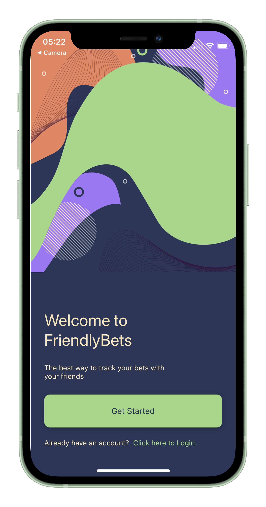
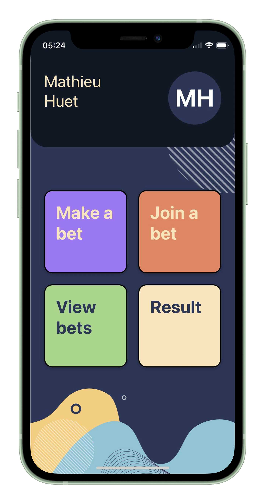

# FriendlyBets **WORK IN PROGRESS**

FriendlyBets is a mobile app (iOS & Android) that keep track of the bets you make with your friends. Create an account, invite your friends to join your bets and keep track of all the bets you've made.

## Getting Started

To install the required dependencies, you're gonna run `npm install` at the root of this repository.

afterward your run `npx expo install` and then to run the app you enter the command `npx expo start`

This app can't work properly if you're not running [the FriendlyBetsServer](https://github.com/mathieuhuet/FriendlyBetsServer), don't forget to point the App toward [the FriendlyBetsServer](https://github.com/mathieuhuet/FriendlyBetsServer) IP and port.

You need to create a `secret.ts` file at the root of the project that export these variables : `FRIENDLYBETS_USER_API` `FRIENDLYBETS_BET_API`

## Tech Stack

The front-end framework is **React Native** and wouldn't been possible without **Expo**

The back-end server is **Express.JS**

The database is **Mongo DB**

## Screenshots

